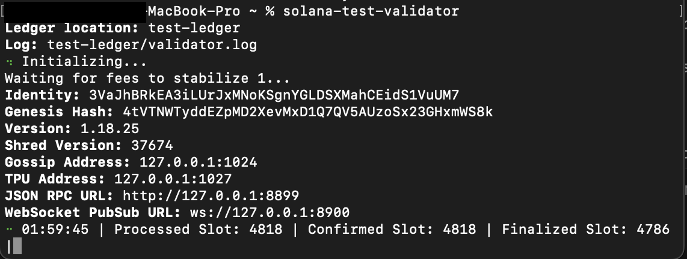
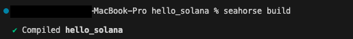
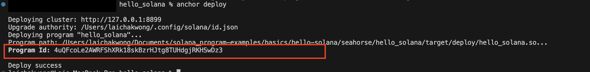
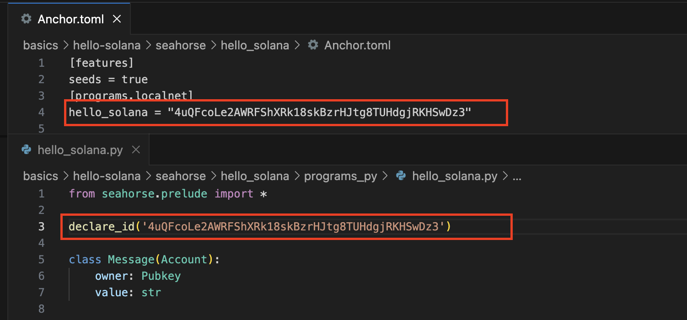
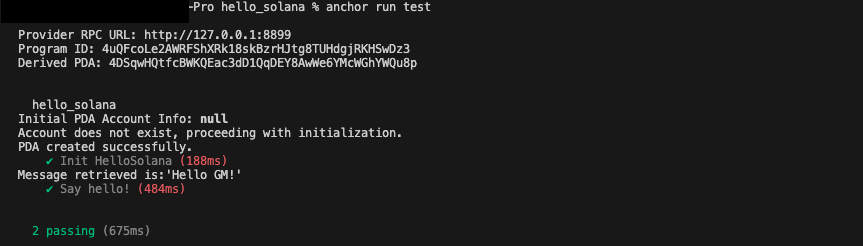

# hello_solana

This project was created by Seahorse 0.2.0. It is a good starting point for using Seahorse, which facilitate Solana developoment in Python.

To get started, you need to install the Seahorse. Please follow the guidelines highlighted here:
[Seahorse Installation](https://www.seahorse.dev/introduction/installation)

After the installation above, open the terminal and run *solana-test-validator*. This start up a local emulator for Solana network.

Now, open another terminal and clone the source. Go to ***basics/hello-solana/seahorse/hello_solana***.

You need to compile the code by running *"seahorse build"*. A successful build will generate output as below:

Run *"anchor deploy"* to deploy the complied program to your local Solana network. 
Take note of the program Id. Compare the one shown in ***Anchor.toml***.

If these 2 IDs are different, update the ID in both the ***programs_py/hello_solan.py*** and ***Anchor.toml***. These IDs have to be the same as the one outputted in *"anchor deploy"*. Save the changes and run *"seahorse build"*, and then *"anchor deploy"* again.

Run *"anchor run test"*. If things go well, following will be outputted. 

You might make changes and add your codes to ***programs_py/hello_solana.py***. The **hello()** function is a good example you can refer to when adding your function. Run *"seahorse build"* and *"anchor deploy"* to get your codes deployed to local Solana network.

Add the corresponding test at ***tests/hello_solana.ts***. The section **it('Say hello!', async()=>...** is a good starting point to look at when adding the test for your function. Run *"anchor run test"* to call and test your codes.
